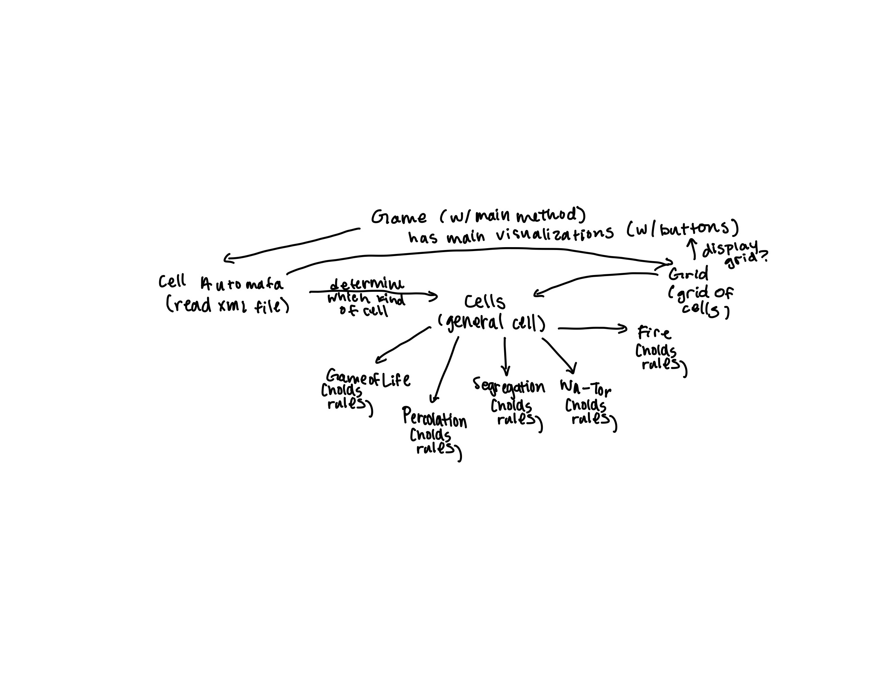
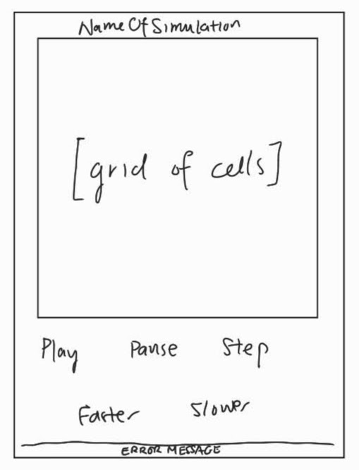

# Cell Society Design Plan
### Team Number 11
### Names:
- Kathleen Chen
- Jessica Yang
- Juhyoung Lee
- Kenneth Moore

## Introduction
We want to create platform for cell automata that can be adapted to any specific variety. We want to
ensure that the majority of the program can run the same between different simulations, and changing
only specific implementations of the rules to differentiate between them. This means that the game
engine should be closed to modification, but the set of rules it's following is open to extension 
and change. In addition, the GUI should also be maintained in a manner that doesn't change between
specific simulations.

## Overview
**Picture**  



**Implementation**
1. neighbors are stored as arraylist
2. neighbors are stored as linked list

both are abstracted away in checkNeighbors()

**CRC Cards**
```Java
/**
 * configuration in constructor
 * then simulation but cell does the heavy lifting
 * 
 * super class for different implementations of the game
 * contain general rule sets
 */
public class CellAutomata {
    /**
     * calls cell update
     */
    public void step();
    
    private void takeXML(String file);
    
}
```

```Java
/**
 * represent a general cell
 *
 * keep track of state, color (gui stuff), neighbors
 *
 * contain update rules
 */
public abstract class Cell {
    /**
     * switch to new state
     * 
     * @return color to be displayed
     */
    public String updateCell();

    /**
     * calculate next state
     */
    public void prepareState();

    /**
     * check its neighbor states
     */
    private void checkNeighbors();
}
```

```Java
/**
 * grid of cells
 */
public class Grid {
  /**
   * create graph
   */
  public void generateGraph();

  /**
   * check neighbors cells at N,S,E,W
   * @param currentCell
   */
  public void checkCardinalNeighbors(Cell currentCell);

  /**
   * check all neighbors
   * @param currentCell
   */
  public void checkAllNeighbors(Cell currentCell);

  /**
   * update all cells to next state
   */
   public void updateAllCells();
}
```

```Java
/**
 * main class that connects simulation to visualization
 */
public class Game{
    /**
     * read xml and create cell automata
     * creates grid
     * visualizes
     * step method will update cell automata
     * visualize
     * repeat past two steps
     */
    public static void main(String[] args);

    /**
     * handles input
     * may be refactored later?
     */
    public void handleEvent();

    /**
     * deals with GUI
     * may be multiple methods
     * may be refactored to class
     */
    public void setUpGUI();

    /**
     * pause, speed up, stuff for gui
     * multiple methods
     * refactored with setUpGUI()
     */
    public void displayGUI();

    /**
     * displays error messages
     */
    private void displayMessage();

    /**
     * takes updated cell states and displays
     */
    private void updateCellGUI();

    /**
     * reads
     */
    private void readXML();

    /**
     * reloads XML and runs the game
     */
    private void reset();
}
```

## User Interface
**Picture**  


**Buttons**
- play
- pause
- step
- slower
- faster
- reset

**Error Messages**
- invalid input
- no input

## Configuration File Format
```xml
<information>
    <type>Game of Life</type>
    <title>Glider</title>
    <author>Richard Guy</author>
    <description>Example of gliders</description>
</information>
<parameters></parameters>
<grid>
    <width>400</width>
    <height>400</height>
</grid>
<cellconfig>
  <cell name="0">
    <neighbors>1,2</neighbors>
    <state>0</state>
  </cell>
  <cell name="1">
    <neighbors>0,3</neighbors>
    <state>1</state>
  </cell>
  <cell name="2">
    <neighbors>0,3</neighbors>
    <state>1</state>
  </cell>
  <cell name="3">
    <neighbors>1,2</neighbors>
    <state>0</state>
  </cell>
</cellconfig>
```
```xml
<information>
    <type>Wa-tor</type>
    <title>Wa-tor</title>
    <author>Alexander Keewatin Dewdney</author>
    <description>Ecological war on toroidal planet</description>
</information>
<parameters>
    <startfish>3</startfish>
    <breedfish>1</breedfish>
    <startshark>1</startshark>
    <breedshark>3</breedshark>
    <staveshark>2</staveshark>
</parameters>
<grid>
    <width>400</width>
    <height>400</height>
</grid>
<cellconfig>
  <cell name="0">
    <neighbors>1,2</neighbors>
    <state>0</state>
  </cell>
  <cell name="1">
    <neighbors>0,3</neighbors>
    <state>1</state>
  </cell>
  <cell name="2">
    <neighbors>0,3</neighbors>
    <state>2</state>
  </cell>
  <cell name="3">
    <neighbors>1,2</neighbors>
    <state>1</state>
  </cell>
</cellconfig>
```

## Design Details
**Component Roles and Collaborations**
- CellAutomata
    - collaborates with Grid, Cell
    - takes configuration and creates appropriate Cell
- Cell
    - updates cell states
- Grid
    - collaborates with Cell
    - collection of cells for GUI
- Game
    - collaborates with CellAutomata
    - runs GUI
    - displays CellAutomata
    
**Extending Components**
- implementing new game types requires new Cell class implementation
    - may need to update CellAutomata to accommodate XML
    - if JavaFX needs to be adapted, need to update Game GUI methods

**Justification**
- Cell being abstract lends to flexibility as well as abstraction
- simulation, configuration, and visualization are separated for SRP

## Use Cases
- Apply the rules to a middle cell: set the next state of a cell to dead by counting its number of neighbors using the Game of Life rules for a cell in the middle (i.e., with all its neighbors)
    - step() CellAutomata
    - checkNeighbors() from Cell
    - prepareState() from Cell
    - updateState() from Cell
- Apply the rules to an edge cell: set the next state of a cell to live by counting its number of neighbors using the Game of Life rules for a cell on the edge (i.e., with some of its neighbors missing)
    - step() CellAutomata
    - checkNeighbors() from Cell
        - would be fewer neighbors to check vs previous case
    - prepareState() from Cell
    - updateState() from Cell
- Move to the next generation: update all cells in a simulation from their current state to their next state and display the result graphically
    - step() from CellAutomata
    - updateCellGUI() from Game
- Set a simulation parameter: set the value of a global configuration parameter, probCatch, for a simulation, Fire, based on the value given in an XML fire
    - readXML() from Game
    - takeXML() from CellAutomata
    - create approriate Cell
- Switch simulations: load a new simulation from an XML file, stopping the current running simulation, Segregation, and starting the newly loaded simulation, Wa-Tor
    - replace XML file with new one
    - reset button runs reset() from Game

1. Slow down the game  
    - press slow button
    - handleInput() from Game
    - changes instance variable in Game
2. Switch from automatic to stepping through
    - press step button
    - handleInput() from Game
    - change instance variable in Game
3. Reset with new starting configuration
    - replace XML file with new one
    - reset button runs reset() from Game
4. Change grid size
    - replace XML file with new one
    - reset button runs reset() from Game
5. Press play with no XML file
    - handleInput() from Game
    - readXML() from Game
    - displayMessage() from Game
6. Move shark from WaTor
    - step() CellAutomata
    - checkNeighbors() from Cell
    - prepareState() from Cell
        - any specific update methods that WaTor might need to implement
    - updateState() from Cell
7. Stop the game 
   - handleEvent()
        - stop() private method 
        - pauses the step method
8. Step button pressed
    - handleEvent()
        - step() private method
        - will perform equivalent of play game, for only one step method, then pause
## Design Considerations
- We debated whether or not there should be a State object that would be responsible for holding the
state of a cell and updating itself, as opposed to the Cell object doing that as well as keeping
track of its neighbors. The reasoning for this possibility is the ability to separate out different
  responsibilities of the Cell class, but implementing it might overcomplicate the implementation.
- Whether or not a Grid class should be created to manage the Cell objects, and if so, if it should
  hold Cell neighbor information. The other option would be to directly create a data structure to
  manage the Cell objects. Using a Grid class would store all the information about the Cell objects
  in one location, but we also aren't sure of what other specific responsibilities it should have, 
  if any.
## Team Responsibilities
We want to have the Game of Life implemented by Wednesday/Thursday, then implement more complex 
simulations, checking how generalizable the program is between simulations. 

 * Jessica: working on Cell and GameOfLifeCell

 * Kenny: working on CellAutomata and XML parsing for cell automata information

 * Juhyoung: working on Grid and XML parsing for cell information

 * Kathleen: working on Game, with running the simulation and JavaFX
